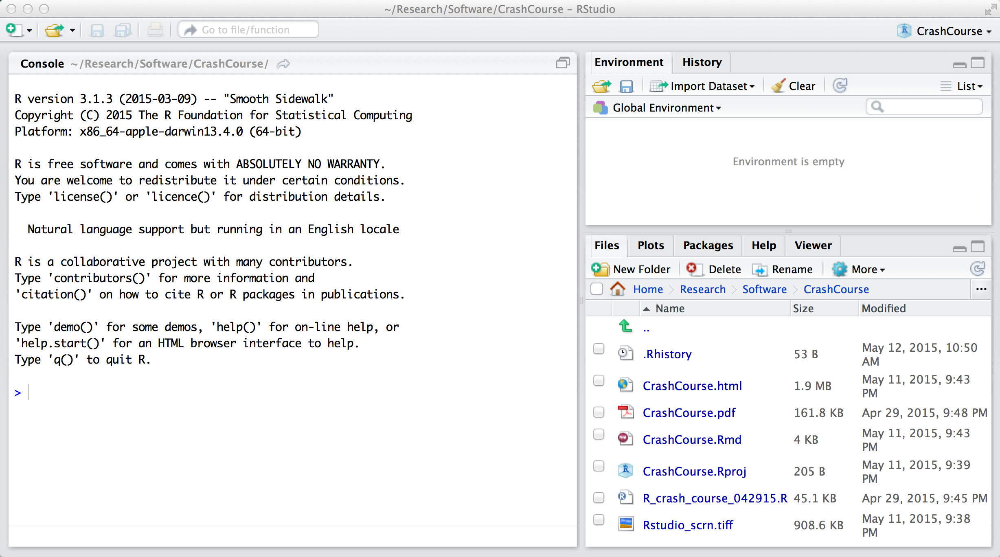
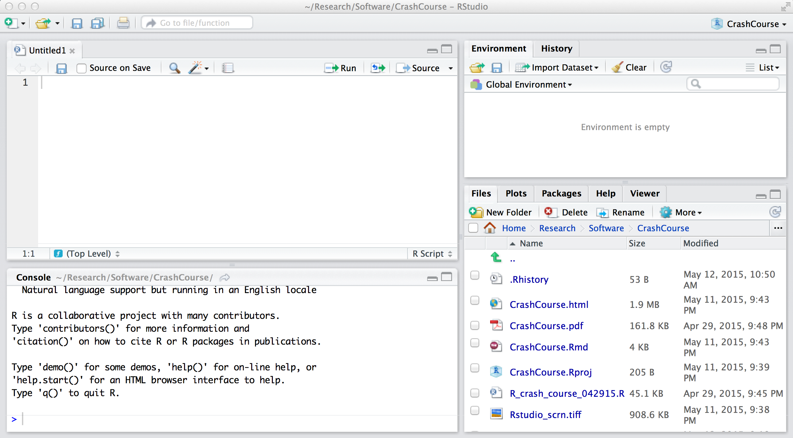

***

Originally prepared for 'Maximum Likelihood Analysis in Ecology', ELME course 2012-2015.

Updates:
12.10.12, fixed frog data.
5.15.15, reformated using RMarkdown, made numerous small changes.

***

# Introduction

This script is intended to present you with a quick and dirty introduction to computer programming and specifically programming in R. A lot of basic R functions and information are presented, but certainly it's nowhere near comprehensive. As with most things, you'll find that if you try things out and mess around with your own examples, you'll learn and retain more of the information. The single best thing you can do to pick up any programming language really, including R, is to get your hands dirty and try things, even if you don't know if they will work. The chances that you'll break something are quite slim, and there's every chance that you'll discover something new for yourself.

If you've done some programming before, some of the concepts may be review; skip what you'd like, but I'd encourage you to at least skim most of the material. In several places I try to explain things that are peculiar quirks of R that can trip up even relatively experienced programmers not used to working in R.

There are a number of sections where I indicated 'Digressions' from the topic at hand. My intention in these sections is primarily to explain smaller, but still useful features or quirks of programming in R. Rather than providing bookmarks for sections to skip reading, my hope was to retain the flow of developing ideas and concepts by noting branching topics treated only briefly in this tutorial. Use them as you see fit.

Please feel free to share this with friends and colleagues, but do try to retain my name on the document. I'd be grateful if you notify me of any mistakes you catch, or share comments on the contents/explanations.


***

# Getting started in R

***

## RStudio interface

Here's what the RStudio interface might look like when you open it up:



There are 3 more (or less) useful windows in view. On the left side is your R Console. This is where you can type in and run short pieces of code, and see the output from the code you execute. On the lower right is a panel that can display a variety of resources, including your file system, plots, the R packages (or tool kits) you have at your disposal, and help files. Finally, on the upper right is a panel that can do useful things like show you what variables you have defined during your session.

Let's open up a new R script (basically like a Word document, but for code!). You can either use a menu (go to File -> New File -> R script) or Shift + Command + N on a Mac (probably Ctrl + N on a PC). This will open up a blank new script for you in the upper left part of your screen.



Scripts are enormously useful, because they allow us to write down and save long pieces of code, which we can revisit again and again without having to type in the same commands over and over again. We'll use them extensively.


## Running commands in R

To execute a command in R you can either:

1. Type or paste it into the command line in the R console (the space after a > ), 

2. Or you can highlight code in an R script and send it to the R console to be executed.  For example, copy the code below, paste it into an R script, then highlight it and hit apple+return if on a mac or (probably) ctrl+R if you're on a PC

```{r,eval=FALSE}
7*2*2
```

You should then see the line above appear in the R console, as well as the result of the multiplication, which we'll call the 'output':

```{r,echo=FALSE}
28
```

Note that for the rest of this document (& course notes), text that appears in gray boxes like those above will be executable R code that you can try out for yourself in RStudio.


## Commenting

R allows you to leave notes or 'comments' for yourself, to help remind you of what different pieces of code mean or do, without altering the function of the code or needing a separate file for your thoughts and explanations. For example:

```{r}
# This is a comment
```

All comments begin with the '#' symbol. You can send these lines to the R console to run, but they will have no effect or result. It can also be a really useful way of de-bugging code, as it's a quick and temporary way to turn off one line of code at a time, which is super handy when you're trying to isolate the source of a problem.


# Arithmetic in R

The usual arithmetic symbols apply, with
+ , - , * , / , and ^, indicating addition, subtraction, multiplication, division, and exponentiation, respectively


#### sqrt(), exp(), log(), log10(), %%
Other useful arithmetic functions include:
```{r,eval=FALSE}
sqrt(49)        # square root of 49
exp(5)	        # returns e^5
log(5)	        # returns ln(5)
log(5,base=10)	# returns log(5) using base 10 instead of the default base e
log10(5)        # so does this
6 %% 5          # calculates the modulus, or remainder of 6/5
```


# Assignment of variables (using <-, ->, and =)

One fundamental component of computer languages like R, essential to performing calculations, is being able to save (or store) things like numbers or characters (think letters and words) or other pieces of information. Just as important is being able to name the place where such information is stored, so we can find it again. In lower level programming languages, this process requires two steps: 1) create a 'box' for storing information, called a variable, and 2) actually storing/putting information in the 'box' or variable. In R we can do this in a single step.

For example, in this line (run it in the console):
```{r}
x <- 2
```

we've created a variable named 'x', and stored a value in 'x' - specifically the number 2. This storage process is sometimes called 'assignment' as in, we're assigning a particular value to the variable named 'x'.

This is a really powerful, handy thing to be able to do, because later we can recall the value of x and use it for calculations and other good things.  For example, go run this in the console:

```{r,eval=FALSE}
x
```

We're asking R what it thinks 'x' is, and it spit back the following output:
```{r,echo=FALSE}
x
```
(the [1] just tells us that we're on the first line of output, while 2 is the actual value that we assigned to variable 'x')

The way that I remember the syntax (or combination of symbols) for assignment is that we're taking the value 2 and sticking it in the variable box 'x', accomplished by typing an arrow pointing from 2 to 'x', its destination.

R will also let us perform assignments in the other direction, as long as we change the direction of the arrow, for example
```{r}
3->x
x
```
results in changing the value of x to be 3.


Finally, and this is the source of frequent confusion, R will let you use the equals sign to assign a value to a variable. So above, we could have said:
```{r}
x=2
x
```
to assign the value 2 to x. 

The confusion that arises is potentially two-fold:

1. The equals sign doesn't make it obvious which direction the assignment goes in. So if we had two variables, x and y
    ```{r}
    x<-4
    y<-3 
    ```
    and we decide that we want to change the value of x to be that of variable y, it's clear how to proceed with the arrows:

    ```{r}
    x<-y
    x
    ```

    but it is much less clear if we write:

    ```{r}
    x<-4
    y<-3 
    x=y
    x
    ```
    (Is x taking the value of y, or is y taking the value of x?)  Basically, the direction of assignment is unclear. The default in R is that '<-' and '=' are the same, but it can be easy to get confused. For this reason, I prefer the use of '<-' and will try to use it in all of my examples.

2. Sometimes when programming, we want to assign a value to a variable, and sometimes we want to answer the question "is the value of this thing equal to the value of that other thing", which is a very different use of the equals sign, bringing us to our next topic.


# Logical statements (==, !=, >, <, >=, <=, |, &)

Let's take our example from above:
```{r}
x<-3
y<-4
```

We can now ask a bunch of questions about x and y, essentially comparing them and answering a true/false question. Are the values of x and y equal to each other?
```{r}
x==y
```
Note here that we use TWO equals signs to test whether two things are equal to each other, in contrast to the use of ONE equals sign described above, which assigns a value to a variable.

Are x and y NOT equal to each other (in other words, are their values different)?
```{r}
x!=y
```

Is x > y? (or x < y)?
```{r,eval=FALSE}
x > y
x < y
```
```{r,echo=FALSE}
x > y
x < y
```

Is x greater than or equal to y? (or, less than or equal)?
```{r,eval=FALSE}
x>=y
x<=y
```
```{r,echo=FALSE}
x>=y
x<=y
```

Finally, we can join together these logical statements to answer more complex questions:
```{r}
z<-3    # adding a third variable we can play with
```

For example, are x and z equal, AND is y greater than z?
```{r}
(x==z) & (y>z)
```

Is x equal to y, OR equal to z?
```{r}
(x==y) | (x==z)
```

There are several other, more arcane logical functions, but with just these you can get a long way.


# Data manipulation

## Kinds of variables

There are many different kinds of data. Numbers are data, but so are words (or 'strings' made up of multiple 'characters', individual letters or symbols). There are even many different kinds of numbers, such as integers (0, 1, 2, 3, 110, -7, etc) or decimal numbers. More on other sophisticated kinds of variables later.

For example, we can save a character string as variable p
```{r}
p<-"word"
p
```

It's important to note that when we write character strings in R, they must fall within " " or ' ', otherwise R will think that we're trying to invoke the name of a variable.

Decimals
```{r}
n<-3.77
n
```
 
Scientific notation
```{r}
s<-10e3
s
```
 
To find out what kind of information a variable holds, we can use a command called `class()`
```{r,eval=FALSE}
class(x)
class(p)
class(n)
```
```{r,echo=FALSE}
class(x)
class(p)
class(n)
```

## Variable names

Acceptable names for variables in R can be pretty extensive, but follow a few rules:
  - they cannot start with numbers
	- they can contain a mix of letters and numbers
	- they can contain periods, '.' and underscores, '_'
	- however, all other punctuation and symbols should be avoided.
 
So this is an acceptable variable name: `crazy.long_name1234`

But this wouldn't be: `4crazy.long@name`


# Data structures

## Vectors

Earlier, we learned how to assign a single value to a variable. It's also possible to assign a set of values to a single variable name, an essential property of working with data in R. 

We can stick multiple values together using the concatenate command, `c()`
```{r}
c(1,2,3)
```

This set of numbers can be assigned to a single variable name
```{r}
x<-c(1,2,3)
x
```

This will prove quite useful, as often we have groups of numbers that share a common association. For example, maybe we measured the number of parasites on 5 different mice. These values all have something in common, an association that will come into play in analyzing and displaying this data.  It's way more efficient to be able to store these values as:

```{r}
x<-c(4,7,8,5,9)
```

than it would be to write:
```{r}
x1 <- 4
x2 <- 7
x3 <- 8
```
These sets of variables, accessed via the name of a single variable, are often called vectors, or arrays. 

\   
Sometimes we want to look at the whole vector:
```{r}
x
```
\   
And sometimes we want to extract a particular value from x:
```{r,eval=FALSE}
x[1]
x[2]
```
```{r,echo=FALSE}
x[1]
x[2]
```

Here the brackets, `[ ]`, indicate that we want to access just a part of x. The number(s) that we put in the bracket indicate the position in the vector x that we want to get a value from (think of it like a numerical address. x is like the name of a street with a bunch of houses. each house is numbered 1, 2, 3, and so on down the street. In in each house there's a value or number or some piece of data that we can look up, given the name of the street and the house number).

So, x[3] will return the 3rd value in the vector x, in this case
```{r}
x[3]
```

We can also grab a few values at a time:
```{r,eval=FALSE}
x[3:5]  	# values 3 through 5
x[-1]		  # everything but the first value
x[c(2,4)]	# the second and fourth values
```
```{r,echo=FALSE}
x[3:5]    # values 3 through 5
x[-1]		  # everything but the first value
x[c(2,4)]	# the second and fourth values
```
\   
We can even ask for just the values in x that meet a certain logical criteria, like
```{r}
x[x>5]
```

This works because inside the brackets, `x > 5` checks each element of the vector x to see if its greater than five, returning a list of TRUE or FALSE, like this:
```{r}
x > 5
```

So, these have the same effect:
```{r}
x[c(FALSE,TRUE,TRUE,FALSE,TRUE,TRUE)]
x[x>5]
```

Note that if we ask for a value that doesn't exist in x, for example, asking what `x[10]` is when x only has 5 values, R tells us that it doesn't know what the value is.
```{r}
x[10]
```


\   
Occasionally, it's useful to be able to add values on to the end of a list.  This can be accomplished using the `append()` function.
```{r}
# This adds the number 42 to the end of x, and saves the result as x:
x<-append(x,42)
x
```
\   


Another way of thinking of a vector is to imagine it as a single column in a spreadsheet of data. The name of the column, your header, is like the name of the variable, and the contents of the column corresponds to the set of values stored in your vector.

Vectors can contain only a single kind of data. So if we try to mix together different kinds of information and save it in one variable, some unexpected things can happen:
```{r,eval=FALSE}
x<-c(1,"bob",3)
x
class(x)
```
```{r,echo=FALSE}
x<-c(1,"bob",3)
x
class(x)
```

Here, we tried to save numbers and character strings (words) in the same vector x. The character string has no convenient numerical representation (ie, we can't convert it into a number meaningfully), whereas the numbers, 1 and 3, can be considered as character strings of one character each, "1" and "3". Consequently, R automatically converts the values we're trying to save in vector x so that they are all the same kind of data, without losing information about the identity of the values. Or, as the help menu writes, R respects a coercion hierarchy (see Details under `?matrix`).


## Generating patterned data

Sometimes it is convenient to be able to generate vectors of data patterned in some way, and, as usual, R has some handy functions for doing this.

#### seq()
`seq(...)` - creates a sequence of values, from the first number, to the second number, with jumps the size of the third number
```{r}
seq(1,10,1)
seq(2,7,0.5)
seq(30,10,-10)
```
\   

#### rep()
`rep(...)` - repeats the first value it is sent the number of times specified by the second number
```{r}
rep(5,3)
rep(2.2,4)
```
\   

#### sample() 
`sample(...)` - randomly samples values from a list supplied to the function, a specified number of times, with or without replacement
```{r}
sample(20,size=5)  # here specifying just 20 leads sample to infer that it's working with a list of integers from 1 to 20.
```
\   

## Matrices

Sometimes we want to create more complicated objects representing multiple dimensions of data. Drawing on the analogy to a spreadsheet above, where we pictured vectors as the column of a spread sheet, we can introduce a new structure called a matrix, which is the equivalent of multiple columns of data all of the same type.

For example, we might have counted the number of insects observed on 5 different plants over 8 observation periods. Each plant might get its own column in the spreadsheet, and each observation period might get its own row. The contents of any given cell in the spreadsheet would contain the actual piece of data, namely, the number of insects observed on a particular plant during a particular observation period.  In R, this structure is called a matrix, and might look something like this:
\   

#### matrix()
```{r}
x<-matrix(sample(20),nrow=8,ncol=5)
x
```
where `matrix()` creates a matrix. In this example, `sample(20)` just grabs a bunch of integers between 1 and 20 for us to fill up our matrix with (because I'm too lazy to type them all out), and `nrow=8` and `ncol=5` specifies the size of the matrix that we want (one with 8 rows and 5 columns, respectively). Just like a vector, a matrix can only contain one kind of data, which can be surprising sometimes (see section on 'coercion hierarchy' above).

*Accessing data:*

The easiest way to understand this is to think about playing the game battleship, or navigating using latitude and longitude. Before, to get data out of a vector, we specified the integer corresponding to the position in the vector that we wanted data from (eg, x[5] yields the 5th element in the list of items comprising vector x). To get data out of a matrix, we have to specify 2 positions (or 'indices'): one providing the row that the piece of data is in, and the other providing the column. This is just like battleship, where you call out coordinates like "A5" or "D7", except instead of using letters and numbers, we just use two numbers, separated by a comma. Or, you could think of the two numbers as specifying a latitude and longitude, locating a point on a map (or a piece of data in a 2-dimensional matrix).

*Examples:*

```{r,eval=FALSE}
x[1,1]	# first row, first column
x[6,3]	# sixth row, third column
```
```{r,echo=FALSE}
x[1,1]  # first row, first column
x[6,3]	# sixth row, third column
```

```{r,eval=FALSE}
x[1,]	# first row, all columns (we don't provide column numbers)
x[,3]	# all rows, third column
x[,]	# all rows, all columns (equivalent to just x)
```
```{r,echo=FALSE}
x[1,]  # first row, all columns (we don't provide column numbers)
x[,3]	# all rows, third column
x[,]	# all rows, all columns (equivalent to just x)
```

```{r,eval=FALSE}
x[,-2]	# everything except the second column
x[-4,]	# everything except the fourth row
```
```{r,echo=FALSE}
x[,-2]  # everything except the second column
x[-4,]	# everything except the fourth row
```

```{r,eval=FALSE}
x[1,2:5]	# first row, columns 2 through 5
x[3:8,2]	# rows 3 through 8, second column
x[3:8,2:5]
```
```{r,echo=FALSE}
x[1,2:5]  # first row, columns 2 through 5
x[3:8,2]	# rows 3 through 8, second column
x[3:8,2:5]
```

## Data frames

One of the awesome things about working with data in R is the introduction of more sophisticated data structures that allow you to keep different kinds of data together, associated with a single variable name. The objects that we use to do this are called data frames.

```{r}
z<-data.frame(col1=c(4,6,7),col2=c("hit","and","sunk"),stringsAsFactors=F)
```
This says, 'z is assigned to be a data frame, consisting of 2 columns, named col1 and col2, composed of `c(4,6,7)` and `c("a","b","c")` respectively.  For now, just ignore the last bit, `stringsAsFactors=F`, or see `?data.frame`

Here's what z looks like
```{r}
z
```
\   

We can use all of the same tricks demonstrated above for matrices to extract bits and pieces of data from data frames, for example
```{r}
z[1,2]
z[2:3,1]
```
\   

In addition, we can refer to the columns of data frame 'z' by name. Again, you can think of the syntax as providing a kind of address:
```{r}
z$col1		# there's column 1
z$col2		# and column 2
```
First we specify the name of the data frame (z), followed by a $ and then the name of the column that we're referring to. Each column behaves individually like a vector (ie, contains only one type of data, and can be indexed like a vector, for example `z$col1[2]` will spit out the second value of column 'col1' in data frame 'z')
\   
\   

In some sense, the commands using the $ syntax are analogous to the following:
```{r}
z[,'col1']
z[,'col2']
```

## Facts about data structures

Often we want to know the size, organization, or content of various data structures, and there are a number of handy commands to help us do this:
\   

#### class()
How do we know what kind of data a particular variable contains? Is it a data frame or a matrix, or maybe a vector? The `class()` command can find out for us:
```{r}
class(z)
class(x)
```
\   

This command can also be applied to individual columns of data frames or matrices:
```{r}
class(z$col1)
class(z$col2)
```
\   

#### length()
'length()' tells us how long a vector is, as in:
```{r}
length(z$col1)  # remember, a column of a data frame is just like a vector
```
\   

#### dim()
`dim()` tells us what the dimensions of a data frame or matrix is
```{r}
dim(z)		# 3 rows, 2 columns
dim(x)		# 8 rows, 5 columns
```
\   

#### nrow(), ncol()
More specifically, we can just find out the number of rows or columns:
```{r}
nrow(x)
ncol(x)
```
\   

#### str()
We can get more details about the contents and kinds of data found in a given data frame by using the `str()` command - think of it like you're inquring about the structure of a data frame:
```{r}
str(z)
```
This displays the name of each column in z, the kind of data in each column, and the first few values in each column.  This is a super useful command for quickly getting a sense of the kinds of data available in a big data set. It can also help uncover problems that arise in analyzing data due to confusion over what class of values particular columns contain.

\   
    
#### head(), tail()
Consider a large data frame: 
```{r,results='hide'}
z2<-data.frame(col1=sample(20,100,replace=T),col2=seq(1,100))
z2		# this would display 100 rows of output - a lot to look at!
```

Instead, we can quickly examine data frames using the `head()` and `tail()` commands, especially useful with large data frames so we don't overwhelm the R console:
```{r}
head(z2)	  # show just the first 6 rows
head(z2,10) # show first 10 rows
tail(z2)	  # show the last 6 rows
tail(z2,10) # last 10 rows
```
\   

This short-cut using 'head()' can be applied to matrices as well.
```{r}
head(x)		# can be applied to matrices as well.
```
\   

#### names(), colnames(), rownames()
We can extract the names of columns and rows in data frame z
```{r}
names(z)
colnames(z)
rownames(z)
```
\   


# Functions

Functions are an essential part of a programming language, allowing you to create sophisticated/complicated computations, and summon them quickly and cleanly to do your bidding. We've actually already sneakily been introduced to functions earlier in this crash course, without specifically recognizing what we were doing.  Things like `length()`, `head()`, `rep()`, `seq()`, and `class()` are all functions.

These functions all follow R rules for naming variables, but they're all followed by () which indicates that they are functions rather than variables. The () are also important because they allow you to send data and information to a function. A function takes the information that you send it in the parentheses, uses it to perform a set of computations or other tasks, and then (usually) returns a number or object to you.

R has a wealth of powerful functions that people have already written that serve as tools for doing all kinds of computations, manipulations, and analyses. 

## Getting help in R

Every pre-built function in R comes with a help file that describes how the function works, what kind of information it needs to work, and what kind of results it will calculate, as well as examples. To access these help files, you can type a '?' in front of the name of any function, for example the `rep()` function:

```{r,eval=FALSE}
?rep()
```
\   

Sometimes there isn't a dedicated help file for the function/topic of your query, in which case you can cast a wider net by typing
```{r,eval=FALSE}
??rep()
```
This locates all occurences of 'rep' in all the help pages of the basic R packages and any additonal packages that you've loaded.
\   

## Making your own functions

Often it is faster and easier to use a function that has already been written and tested to perform a task, but it is also possible and useful to be able to make your own functions - especially in order to understand how functions work.  Here are some basic examples:

```{r,results='hide'}
# this function is named 'add'.  It receives no information, and performs no calculations, but is still a properly defined function
hohum<-function(){
  # this is where we'd write the computations to be performed	
}
```

If we run it,
```{r}
hohum()
```
We see that it provides an empty/nonexistent result.
\   

Now let's make a function that does something
```{r}
# first a clean version that's easy to see, 
# then the same thing with comments describing each piece:
add<-function(b,c){
	sum.result<-b+c
	return(sum.result)
}
```

```{r}
# This function will be named 'add', and needs to receive 2 values, 
# which it will name b and c, when it is 'called' or asked to do its job.
add<-function(b,c){		
  # inside of the function (everything that happens between the first { and the last } ), 
  # we can perform calculations, such as adding together b and c and 
  # saving them as a new variable, 'sum.result'
  sum.result<-b+c	
  
  # as a last step, if we want our function to send the results of 
  # its work back to us, we use the return() command to instruct the 
  # function what information to return.
	return(sum.result)	
}
```
\   

Let's run our new function and see what happens:
```{r}
add(2,3)
```
\   

Note that we have to send the function all of the values it is expecting to receive, otherwise an error will occur. For example, `add(3)` will not run, and instead produces an error message: `'Error in add(3) : argument "c" is missing, with no default"'`

There are ways to specify 'default' arguments when you create your functions, not detailed here.

***

*Digression*

Note also that the variable that we created inside of our function, `sum.result` exists only within the little world of the function itself, so if we ask R what it thinks the value of `sum.result` is, we get an error message: `"Error: object 'sum.result' not found"`

That's because R doesn't know what we're talking about. Computer scientists would call `sum.result` a 'local variable', ie, a variable that is only defined/exists locally within a program - in contrast to a 'global variable' that is defined everywhere, both inside and outside of functions and loops and things. This is a pretty handy feature, because it can prevent functions and their variables/computations from interfering with each other and having unexpected results.

***


So now we can use a function to add two numbers together. Woop-dee-doo - couldn't we already do that by writing 2+3? What's the big fuss over functions? The beauty of functions is that there's no real limit to the number or complexity of computations that we can perform inside of the function, and the results that we can return.

```{r}
# here's a crazier function
crazy<-function(b,c,d){
	res1<-exp(5*b)
	res2<-c*res1+d
	res3<-log(res2)
	return(c(res1,res2,res3))
}

crazy(6,3,2.7)
```
We'll run into functions again...
\   


# Decision and Control statements 

These are the bread and butter of computations and algorithms, as they allow computer code to make 'decisions' and to repeat calculations or steps over and over again.


## Conditional statements (ifs and elses)

These statements allow you to implement different code (or have your code follow different directions depending on some criteria that can be determined to be `TRUE` or `FALSE`). Statements that test whether something is `TRUE` or `FALSE` are called logical statements and rely on operations like >, <, == or != (for more, see earlier portion of this tutorial)

Say we have some value x having a value between 0 and 1, and we want to round it to be exactly 0 or 1, depending on whether or not it is larger than 0.5.
```{r}
x<-0.67
```
\   

#### if()
An `if()` statement can help us do this:
```{r}
if(x >= 0.5){
  x<-1
}
x

# here, the syntax says: 
# if(this stuff is true){ 
#   carry out all the steps inside of these curly brackets 
# }
```
That works pretty well if x is greater than (or equal to) 0.5, but will have no effect on x if it's less than 0.5 (try it out!)
\   
\   

The best friend of an `if()` is an `else`, which provides instructions on what to do when the if condition is false.
```{r}
x<-0.2

if(x > 0.5){
	x<-1
}else{
	x<-0	
}
x

# here, the syntax says: 
#
# if(this stuff is true){ 
# 	carry out all the steps inside of these curly brackets 
# }else{
#	do all of these steps instead	
# }
```
\   

#### ifelse()
This is super handy and all, but what if x is a whole bunch of values instead of just one? (ie, x is a vector)? Well, there's another version of this if/else set up that can operate on vectors or single values:
```{r}
x<-0.67
ifelse(x >= 0.5, 1, 0)
# this says:
#	ifelse( if this is TRUE, return this value, otherwise return this value)
```
\   

There's one important difference in our code: our earlier examples of `if(){}else{}` actually changed the value of x, whereas the `ifelse()` statement above only returned what the new value of x should be.  If we check the value of x:
```{r}
x
```
it hasn't changed. 
\   

To actually change x we would need to write
```{r}
x<-ifelse(x >= 0.5, 1, 0)
```
This uses the current value of x, decides if it is less than 0.5 or greater than/equal to 0.5, returns 1 or 0 correspondingly, and saves that value to x, overwriting any previous value saved in x.

Finally, we can apply `ifelse()` to a vector of values:
```{r}
x<-c(0.97,0.32,0.75,0.49,0.16)
x<-ifelse(x > 0.5, 1, 0)
x
```
Here the `ifelse()` operation is automatically performed on each element of vector x individually, and the result is itself a vector.


## Loops

When programming, we frequently want to perform the same calculation repeatedly, or on each value of a vector (as in our use of `ifelse()` in the previous example). The structures that allow us to do this are called loops, and come in 2 primary kinds, the `for()` loop and the `while()` loop. The `for()` loop lets us perform a set of calculations a fixed number of times. The `while()` loop performs a set of calculations over and over again until a condition is met (ie, a logical statement goes from being `TRUE` to being `FALSE`).

#### for()
Let's start with the `for()` loops. Here's an example:
```{r}
x<-3
for(i in 1:4){
	print(i)
	x<-x+1
}
x
```

What's happening here? Let's take a look at the syntax. First, `for(i in 1:4){ stuff }` says to repeatedly calculate the 'stuff' for as many steps as it takes i to go from i=1 to i=4 (by increments of 1 as a default).

What's the 'stuff': 

1.  `print(i)` tells the `for()` loop to print out the value of i. Every time we run through the loop, the print command is executed. This is why we see:
    ```{r,echo=FALSE}
    x<-3
    for(i in 1:4){
        print(i)
	      x<-x+1
    }
    ```
    Each time the loop executes the 'stuff', it increases the value of i by 1, starting with i equaling 1 and continuing until i equals 4.

2. `x<-x+1` changes the value of x each time the loop is executed. Basically, it says 'add 1 to the value of x and overwrite (or update) x to be this new value'.  This has the effect of increasing x by 1 every time the loop runs. Using a little math, we would expect then that after running the loop, x should equal its initial value plus 4 (the number of times the loop has run). We can check that out:
    ```{r}
    x==3+4
    ```
\   


For a more complicated example, we can use a `for()` loop combined with `if(){}else{}` to accomplish the same task as the `ifelse()` statement above:

As an intermediate step, take a look at how we can use a `for()` loop to focus on each individual element of vector x:
```{r}
x<-c(0.97,0.32,0.75,0.49,0.16)
for(i in 1:length(x)){
	print(x[i])
}
```
This `for()` loop starts with i=1 and keeps going until i = `length(x)`, or i = number of elements in vector x.  Each time the loop runs, it prints out the value of x[i]. The first time the loop runs, i = 1, so we see x[1], the first element in vector x. The next time the loop runs, i has been increased to i = 2, so we see x[2], the second element of x, and so on until i = `length(x)` and we see the last element of vector x.

Now we can get more sophisticated. This loop is very similar, but instead of printing out the value of each element of x as we go through the loop, here we use an `if(){}else{}` statement to check each individual element of x to see if it is >= 0.5, and then change the value of that element accordingly.
```{r}
x<-c(0.97,0.32,0.75,0.49,0.16)
for(i in 1:length(x)){
	if(x[i]>=0.5){
		x[i]<-1
	}else{
		x[i]<-0
	}	
}
x
```
\   

Can you use a `for()` loop and an `if(){}else{}` statement to determine if a list of values is even or odd? How about with the `ifelse()` function?
\   
\   

#### while() 

Sometimes we won't know ahead of time how many times we want to repeat a set of calculations. `while()` loops can be useful in these situations, because they let us repeat calculations indefinitely, until a logical statement goes from being `TRUE` to being `FALSE`.

For example, say that we want to keep drawing random numbers between 0 and 1, until we get a number greater than 0.8:
```{r}
current.number<-0	# set this number to be less than 0.8 so that our loop will run at least the first time.
while(current.number<=0.8){
	current.number<-runif(1)	# runif(1) generates 1 random number from a uniform distribution ranging from 0 to 1 - don't sweat the details yet.
	print(current.number)
}
```
```{r}
# syntax:
#	while(this statement is true){
#		run this stuff
#	}
```
Try running that code several times, and observe its behavior. Each time it runs, it should spit out a list of a varying number of decimal numbers, where only the last number is greater than 0.8.  (It's different each time because we are generating different random numbers each time the loop executes).

CAUTION: `while()` loops can be super useful, but they are also dangerous, because they can lead to something called an 'infinite loop'. Basically, if the logical statement can never become false, then the loop will just keep on running forever and ever, until your computer or battery dies or gets shut off, or you close the program.  This is a pretty undesireable thing to have happen.

BEFORE you try the example below, make sure you know how to stop a piece of code that's running in your R console. Unfortunately, this depends on what operating system you're using as well how you're working with R (RStudio, default R, or some other interface). In RStudio you can click on the consol then hit 'Esc' (escape) and that should end the currently running calculation. On the basic R program, there's a red stop sign in the upper left hand corner of the R console, which works - sometimes. You can also try typing ctrl + c (or command + c on a mac?). When you get tired of the infinite loop running, you need to use one of these approaches to stop it - it won't stop on its own.

Note that these approaches won't always stop R from executing the code you've asked it to evaluate, depending on some technical details. For this reason, it's always a good idea to save your code, etc. before running a function that might get caught in an infinite loop, or otherwise take a really long time. Sometimes the only way to stop R is to close and restart it.

Here's an example of an infinite loop - be bold!
```{r,eval=FALSE}
while(2>1){
	print("to infinity and beyond!")
}
```
\   

One way to prevent an infinite loop is to set an upper limit on the number of times that the while loop can be executed:
```{r}
counter<-1
current.number<-0
while(current.number<=0.99 & counter<=50){
	current.number<-runif(1)
	print(c(counter,current.number))
	counter<-counter+1
}
```
Run this a couple of times and see how it behaves. Sometimes the output will stop because the loop encounters a number greater than 0.99 before it tries 50 times. But sometimes the counter gets to 50 and our while loop is halted before we observe a number greater than 0.99.

This can be super handy if we made a type-o when writing our loop, and wrote 99 instead of 0.99. Without the counter, this loop would never stop, because our random numbers will always be less than 99.  With the counter, it will automatically stop after 50 attempts.

```{r}
counter<-1
current.number<-0
while(current.number<=99 & counter<=50){
	current.number<-runif(1)
	print(c(counter,current.number))
	counter<-counter+1
}
```

## Advanced loops

R has a set of functions that serve as alternatives to the classic `for()` loop as it's used to perform calculations on the elements of a vector, with advantages in terms of how quickly they run, and how concisely they can be written. This tutorial will mention them only briefly, but they're well worth learning more about:
\   

#### apply(), sapply(), lapply(), tapply()
```{r}
?apply()
?sapply()
?lapply()
?tapply()
```

Let's return to our example of classifying numbers between 0 and 1 as either 0 or 1 exactly:
```{r}
x<-c(0.97,0.32,0.75,0.49,0.16)
sapply(x, FUN=function(y) if(y>=0.5){y<-1}else{y<-0})
```

This is equivalent to what we did before,
```{r}
ifelse(x>=0.5,1,0)
```
but far more flexible, because we could put any function that we want to after the FUN= part in the call to `sapply()`.  This is a handy way of applying any general function of interest to all of the elements of a vector.

These advanced loop functions come in several flavors. `apply()` works on the columns or rows of a matrix; `lapply()` works on the elements of a 'list' - a kind of data structure in R that we haven't covered yet, but will run into shortly.

\   
\   

# Data manipulation (Advanced):

##Importing data

NOTE: For this exercise you'll need the two data files found at 
http://www.msu.edu/~kremerco/frog_pred.csv
http://www.msu.edu/~kremerco/frog_pred.txt

So far, all of the 'data' that we've worked with in R we've either entered by hand, or generated using functions like `seq()`, `rep()`, and `sample()`. For R to be useful in analyzing real data sets, we need to learn how to load (or read) existing data sets from other files, as it would be a nightmare to have to enter data by hand into R.  Fortunately, this is quite easy to do, for a variety of file formats.

My personal preference is to work with .csv, or comma separated value files (which can be created in excel). So that's what I'll demonstrate first:

\   

#### read.csv()
This function `read.csv("filepath")` reads a .csv file located at "filepath" into R as a data frame. If you're trying this out on your own computer (as you should), you'll need to change the file path below to reflect the location of the frog_pred.csv file that you just downloaded on your own computer.
```{r}
data<-read.csv("/Users/colin/Teaching/ELME/ELME 2015/frog_pred.csv")
head(data)
```
\   

Alternatively, you can instruct R to let you browse through your file directories to select a particular file to load.
```{r,eval=FALSE}
data<-read.csv(file=file.choose())    # this can be convenient, but also problematic, because it doesn't leave behind a permanent record of what data file you actually loaded, potentially making it hard to remember what you did later.
```
\   

#### read.table()
If your data are saved in a format that's not a .csv file, you may still be able to load it in to R, from a .txt text file format (among others) using the `read.table()` command:
```{r}
data<-read.table("/Users/colin/Teaching/ELME/ELME 2015/frog_pred.txt",sep=",",header=T)
```
Here I've specified that the character used to separate different elements in the data is a comma, via `sep=","`. I've also told `read.table()` that the file has a header (with column names), via `header=T` . Many many more options are available, so be sure to check out the help file at `?read.table()`

\   

## Working directory

Every time you open up R, it defaults to calling a particular directory directory on your computer its 'home' or its 'working directory'.  This becomes the first place that it looks when you tell it to load data, and also the location where any files you tell R to create are saved.

\   

#### getwd(), setwd()
To find out what R thinks your working directory is right now, try:
```{r}
getwd()
```

Often, the default or initial directory isn't the one that you want to be working in for a particular project. It's important then to be able to change the current working directory. You can do this typically through the file menus in R, but also directly by setting the working directory via the command `setwd()`:
```{r,eval=FALSE}
setwd("/Users/colin/Teaching/ELME/ELME 2015/")
```
Again, the advantage to doing this is that any files we create will be saved to this folder (unless we explicitly specify a different location when saving files).

Additionally, when it comes to loading data files, we can take a short cut and just write
```{r,eval=FALSE}
read.csv("frog_pred.csv")
```
which avoids the need to write out the complete file path, because R defaults to looking in the current working directory.

\   

## Practice looking at data

This particular data set we've just loaded describes the results of an experiment looking at predation on frogs as a function of frog size, and the density of frogs in a tank.

Several functions that we learned earlier are quite useful for quickly looking at these data:
```{r}
dim(data)
names(data)
head(data)
str(data)
```
In particular, str(data) shows us that this data consists of 5 columns, containing integers (density and surv columns), numbers (propsurv column), and lastly, these curious things called Factors, which we haven't run into before in this tutorial.

\   

## Factors

Factors are both a terrifically useful and a terrible type (or class) of variable. They exist simultaneously as both character data and numerical data, which can make them quite confusing to work with. It's worth spending a little bit of time learning about them here, because they *will* cause you trouble sooner or later.

To try to understand what it means for factors to be both characters and numeric, let's focus on the predation column first:
```{r}
data$pred  		    # here's what the whole vector looks like if we ask for it directly
class(data$pred)	# the class of this vector is "factor"
```
\   

To get a more informative view of what this factor `data$pred` consists of, it helps to apply a function called `unclass()`, which just removes the 'factor' class from this vector.
```{r}
unclass(data$pred)
```
Here we can see that the vector itself consists of 1's and 2's, but that the vector has an extra attribute attached to it called 'levels', which contain the labels (character strings) "no" and "pred".

This factor implicitly matches
    *  "no" 	to	 1, and 
    * "pred" 	to	 2

On the surface this seems like a crazy scheme - why on earth would we want both numerical and character data mashed together in the same column and called a factor?

It turns out that for many statistical models it is much more convenient to work with a vector of integers describing which treatment or category a particular data point is a member of, rather than characters or names. Basically, it's easier for computers to work with numbers, which are easier for performing computations. However, long lists of integers aren't meaningful to (most?) humans - we remember what different treatments mean much more easily if they are referred to by a name than by a number.  Factors attempt to retain categorical data in a form that is convenient for use in statistical modeling but also easy for humans to look at and understand as well - a worthy goal.

Factors can cause problems though if not handled carefully - we have to make sure that they give us characters when we want characters, and numbers when we want to work with the corresponding numerical codes.  For this reason, you will often see factors converted into other data classes, like character or numerical.

\   

#### as.character(), as.numeric()
For example:
```{r}
data$pred.character<-as.character(data$pred)
data$pred.numeric<-as.numeric(data$pred)
# here we've added two new columns to our data frame, pred.character and pred.numeric, by forcing a factor, data$pred, into a character or numerical form.
```

What's the result of this:
```{r}
str(data)
```
Notice the addition of columns `$pred.character` and `$pred.numeric` to the data frame, and the class of variable that they have become (character and numeric, respectively)

Alternatively, we can take a character vector and convert it into a factor by doing something like this:
`as.factor(data$pred.character)`.

\   

#### levels()
The function `levels()` can be a useful way of finding out what levels of a factor exist:
```{r}
levels(data$pred)
```
\   


## Locating particular values in a vector

Sometimes we have a vector of data and we know that it contains particular pieces of data, but we don't know where in the vector they occur. There's a function that was made for this situation (literally)

\   

#### which()
The function `which()` tells us the integers corresponding to the positions in a vector satisfying some logical condition. In otherwords, it tells us where in a vector particular values occur. For example,
```{r}
which(data$density>10)	# which elements in data$density are larger than 10?
```
\   

If we save them we can use these integer locations to do some useful things. For example we can look at the proportion of frogs surviving predation (data$propsurv) when the density of frogs is > 10:
```{r}
locations<-which(data$density>10)
data$propsurv[locations]
data$density[locations]
```
\   

This is similar to an approach introduced earlier:
```{r}
data$propsurv[data$density>10]
```
which works because `data$density>10` produces a logical vector (a vector consisting of `TRUE` and `FALSE`), 
```{r}
data$density>10
```
and only the elements of data$propsurv where `TRUE` occurs are retained.

\   

#### %in%
It's also possible to use a short cut called `%in%` to figure out the intersection of lists of values, which can be really handy at times.

Here's an example. Supposed we have a list of letters:
```{r}
letters<-c("a","d","e","a","f","b","b")
```

If we want to pull out every instance of the letter "a" we could do something like this: 
```{r}
letters[letters=="a"]
```

But maybe we're interested in more than one letter, perhaps "a" and "b" and we want to find all instances of either letter. We've got a few options:

1. This works, but it's long, and gets longer with each additional case we're looking for.
    ```{r}
    letters[letters=="a" | letters=="b"]
    ```

2. This is much shorter/more efficient:
    ```{r}
    letters[letters %in% c("a","b")]
    ```

Let's tear apart this second example. The code:
```{r}
letters %in% c("a","b")
```
checks each element of letters one at a time, to see if it appears in the list of interesting cases after `%in%`, returning `TRUE` or `FALSE`. The `TRUE`/`FALSE` list is then used to spit back only the entries of 'letters' that we're interested in.
\   


## Accessing a subset of your data

It is often desirable to be able to focus on a subset of your entire data set, rather than trying to analyze or work with the whole beast at once. The methods introduced above can be used to accomplish this. Here are some examples:

1. Create a subset of data with only the rows in which `data$density` is equal to 10 (but including all columns):
    ```{r}
    data2<-data[data$density==10,]
    data2
    ```
2. Or a subset with only the rows where density equals 10 and size equals 'big'
    ```{r}
    data3<-data[data$density==10 & data$size=="big",]
    data3
    ```
3. The `which()` command can be used for these purposes as well:
    ```{r}
    locations<-which(data$density==10 & data$size=="big")
    data4<-data[locations,]
    data4
    ```
\   

#### subset()
Finally, there's an explicit command called `subset()` that can be used as well:
```{r}
data5<-subset(data,data$density==10 & data$size=='big')
data5
```

\   

# Data review/Descriptive statistics:

It can be helpful to be able to generate quick numerical summaries of different portions of your data.  Here are some relevant functions:

#### summary()
The function `summary()` provides basic summary statistics for different classes of data.
```{r}
summary(data)  		      # for entire data frames
summary(data$propsurv)	# or single vectors
```

#### table()
The function `table()` reports the number of times each unique value can be found in a given vector.
```{r}
table(data$density)
```
Or for multiple vectors:
```{r}
table(data$density,data$pred)
```

\   

#### mean(), var(), sd(), median(), quantile()
There are several other self explanatory functions:
```{r}
mean(data$propsurv)								# mean of data
median(data$propsurv)							# median of data
quantile(data$propsurv,probs=c(0.05,0.5,0.95))	# any given quantile
var(data$propsurv)								# variance
sd(data$propsurv)								  # standard deviation
```

\   

# Plotting data

An essential part of understanding your data is visualizing it. There are entire books on this topic, and a R is a powerful tool for customized plotting. For now, here are some basic commands to get us started:

\   

#### plot()
To make a scatter plot of bivariate data, try `plot()`
```{r}
# Syntax: plot(y values ~ x values, data=name.of.data.frame.containing.x.and.y)
plot(propsurv~density,data=data)
```

\   

#### boxplot()
To make a box plot, try `boxplot()`
```{r}
boxplot(data$propsurv)
boxplot(data$propsurv~data$pred)
```

\   

#### abline(), segments(), points()
We can add lines, segments and points to a figure:
```{r}
plot(propsurv~density,data=data)
abline(0,0.03)          # add a line with given intercept, slope
segments(15,0.2,30,0.8,col='blue')            # add a (blue) line segment given its endpoints
points(data$propsurv~data$density,col='red')  # add (red) points to a plot
```

\   

Much more on plotting can be found in upcoming lab activities, where we have more data to play with and visualize.


# R packages

As mentioned earlier, there are an enormous number of functions and tools that the R community has developed. Many of them are highly specialized, so the basic distribution of R comes with only a subset of all possible functions installed. To access the other functions that people have written, there are 2 approaches:

1. If the functions/tools are bundled together and available in a formal R package (like the maximum likelihood tools we'll be using, which are located in a package called 'bbmle'), you can download and install the desired package via the `install.packages()` command:
```{r,eval=FALSE}
install.packages("bbmle")
```
You can also do this using menus/windows of your R gui. For example, in RStudio, there's a 'Packages' tab at the top of the panel in the lower right of the screen, where you can see what packages you have loaded or installed, as well as search for new packages.

When you want to actually use a package that you have downloaded and installed, you have to load it - usually every time you restart R. This can be accomplished with the `library()` command, as in:
```{r}
library(bbmle)
```

2. Often people will have written a couple of useful little functions that they haven't turned into a formal R package (which takes more work). This is something that you might even do yourself. If these extra functions are kept in an R script (a file ending in .R), you can instruct R to go open that script and silently execute everything it contains - basically like loading your own personal functions.  The command for this is `source()`:
```{r,eval=FALSE}
source("name_of_script.R")
```

***

All for now. Contact me with any questions or corrections at colin [.] kremer [at] yale [.] edu

Hope this was helpful! 

